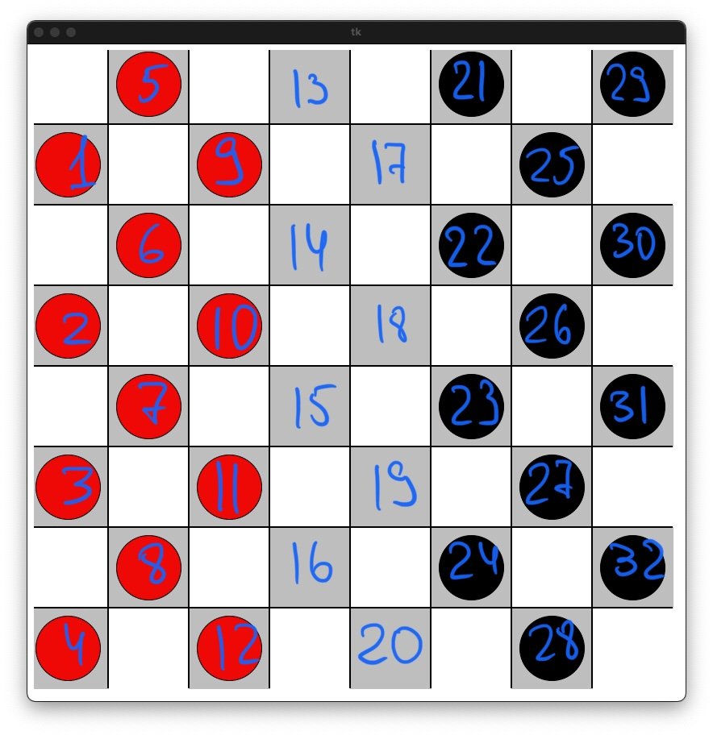

# foai-checkers-server
Server for Checkers contest as an exam for Fundamentals of AI course at NaUKMA

## How to run server
1. Install `python 3` and `pip` from https://www.python.org/downloads/.
2. (Optional) Use [`virtualenv`](https://packaging.python.org/guides/installing-using-pip-and-virtual-environments/) for python in order to install modules in project directory only and not to collect trash in your OS.
3. In project folder run `pip install -r requirements.txt`
4. Run `python main.py` to run server or `python main.py test` to run server and tester to see the game in action.
> If you have both python 2 and python 3 in your OS, you may want to use `python3` for commands stated above.

> **Note:** Default server host/port is `127.0.0.1:8081`. If you want to run server on non-default host/port, you may change any of these values at `config/checkers-back.yaml`. 

## The map of cells used

